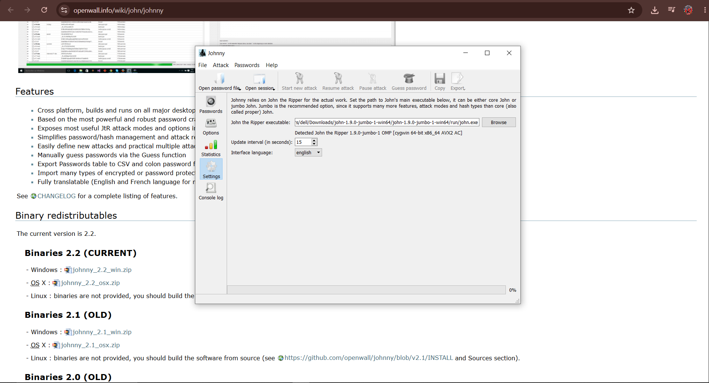
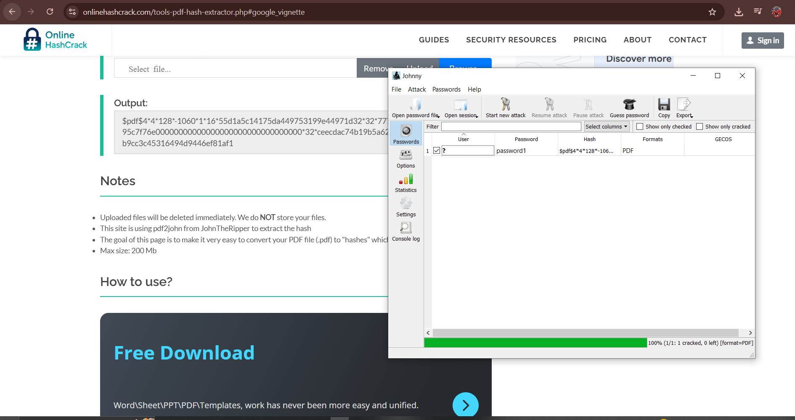
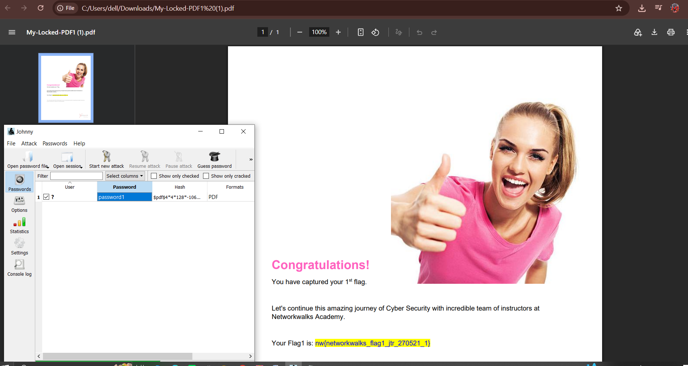
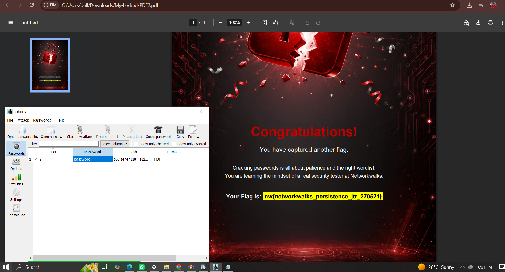
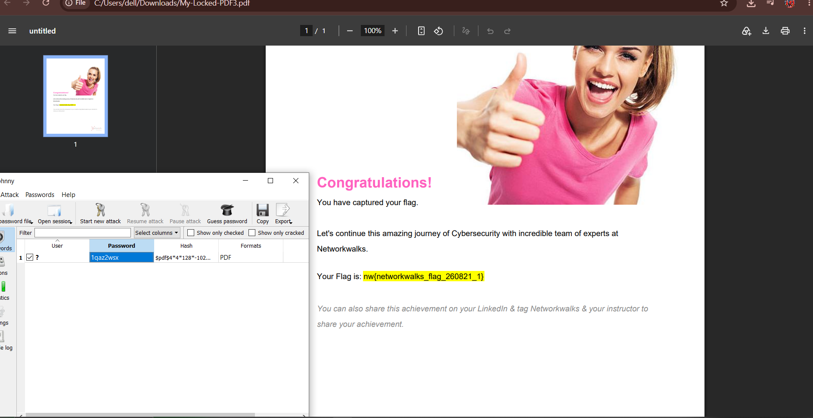
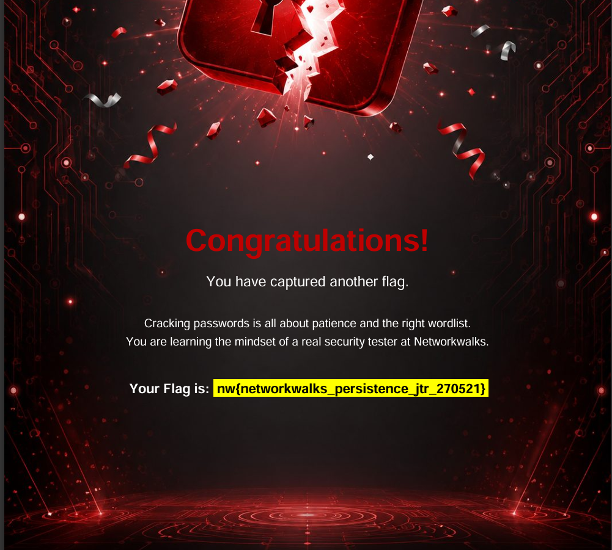
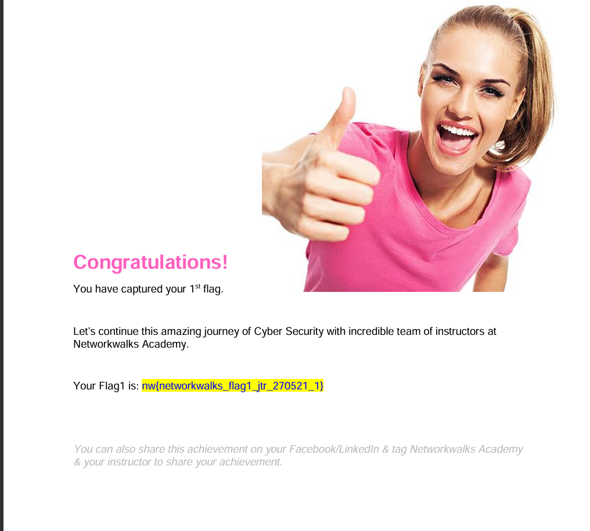
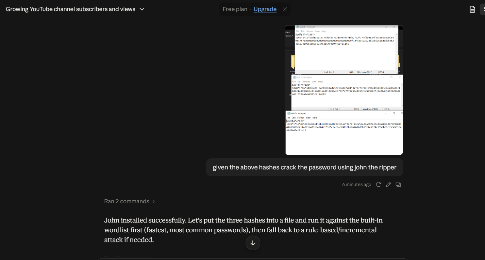
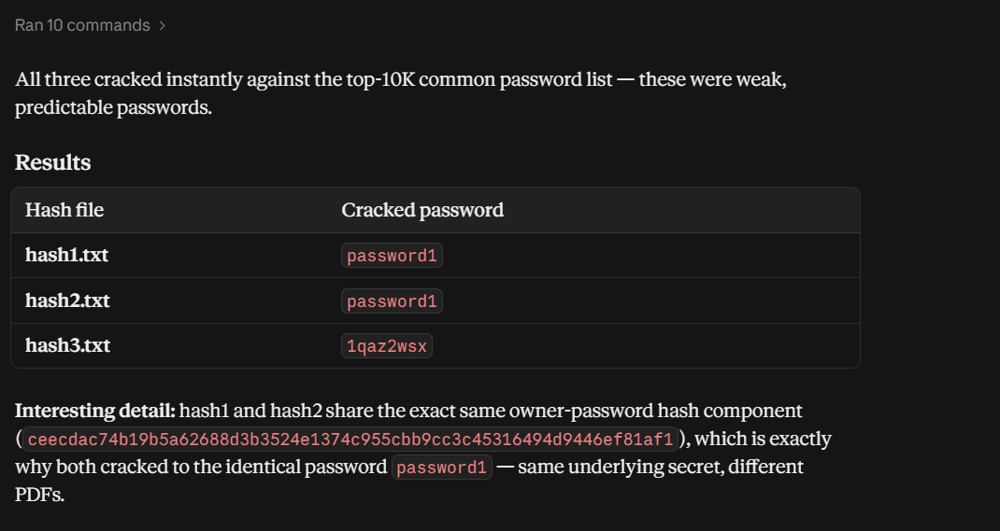
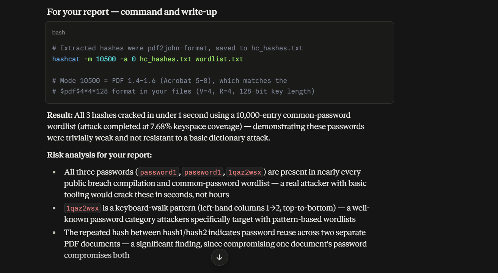

# 🔐 Password Cracking Lab — John the Ripper & PDF Security Testing

**Cybersecurity Internship — Week 3 | NetworkWalks Academy**

> ⚠️ **Disclaimer:** All activities documented in this repository were performed in an **authorized, isolated educational lab environment** using self-generated sample PDF files. No third-party systems, accounts, or real-world data were accessed. This content is shared strictly for **educational and ethical hacking training purposes**.

---

## 📌 Overview

This repository documents a hands-on lab exploring **password cracking techniques** against password-protected PDF files, using three different approaches:

1. **John the Ripper (JTR) via Johnny GUI**
2. **NetworkWalks online hash/cracking tools**
3. **AI-assisted workflow** (hash extraction + JTR command generation)

The goal was to understand how weak, predictable passwords can be recovered using dictionary attacks, and to reinforce best practices around password hygiene and PDF encryption.

---

## 🧠 Key Concepts Covered

- PDF encryption formats (`$pdf$4*4*128*...`) — Acrobat 5–8 / PDF 1.4–1.6
- Hash extraction using `pdf2john`
- Dictionary (wordlist) attacks vs. brute-force/incremental attacks
- Password reuse detection across multiple files
- Hashcat mode `10500` for PDF hashes
- Risk analysis and reporting of weak credentials

---

## 🛠️ Module 1 - Password Cracking with John the Ripper (Johnny GUI)

**Steps performed:**
1. Extracted the hash from a password-protected PDF using `pdf2john`.
2. Installed and configured **Johnny** (GUI front-end for John the Ripper).
3. Loaded the hash file into Johnny and started a new attack using the built-in wordlist.
4. Password was cracked and verified by unlocking the PDF.

**Tools used:** John the Ripper (Jumbo build), Johnny GUI

**Result:**
| File | Cracked Password |
|------|-------------------|
| My-Locked-PDF1.pdf | `password1` |
| My-locked-PDF2.pdf | `password1` |
| My-Locked-PDF3.pdf | `1qaz2wsx`  |

















🏁 Flag captured: `nw{networkwalks_flag1_jtr_270521_1}`

---

## 🛠️ Module 2 - Password Cracking with NetworkWalks Tools

**Steps performed:**
1. Used the **NetworkWalks Hash Calculator** to extract the PDF hash.
2. Ran the **NetworkWalks Password Cracker** against the extracted hash.
3. Verified the recovered password by opening the protected file.

**Results:**
| File | Cracked Password |
|------|-------------------|
| My-Locked-PDF2.pf  | `password1` |
| My-Locked-PDF2.pdf | `password1` |
| My-Locked-PDF3.pdf | `1qaz2wsx` |








🏁 Flags captured:
- `nw{networkwalks_persistence_jtr_270521}`
- `nw{networkwalks_flag_260821_1}`

---

## 🛠️ Module 3 - AI-Assisted Cracking Workflow

**Steps performed:**
1. Extracted hashes from all three locked PDFs (`pdf2john` format) and saved them into `.txt` files.
2. Uploaded the hash files to an AI assistant (Claude) for analysis.
3. Prompted the AI to generate the correct `hashcat`/JTR command and execute a dictionary attack.

**Command used:**
```bash
# Hashes extracted via pdf2john, saved to hc_hashes.txt
hashcat -m 10500 -a 0 hc_hashes.txt wordlist.txt

# Mode 10500 = PDF 1.4–1.6 (Acrobat 5–8)
# Matches $pdf$4*4*128 format (V=4, R=4, 128-bit key length)
```

**Results — all 3 hashes cracked in under 1 second (10,000-entry wordlist, 7.68% keyspace coverage):**

| Hash file | Cracked Password |
|-----------|-------------------|
| hash1.txt | `password1` |
| hash2.txt | `password1` |
| hash3.txt | `1qaz2wsx` |

**Interesting finding:** `hash1` and `hash2` shared the **exact same owner-password hash component**, confirming password reuse across two separate PDF documents — meaning compromise of one document's password compromised both.










---

## 📊 Risk Analysis Summary

- All recovered passwords (`password1`, `1qaz2wsx`) appear in nearly every public breach compilation and common-password wordlist — an attacker with basic tooling could crack these in seconds.
- `1qaz2wsx` is a **keyboard-walk pattern** (left-hand columns 1→2, top to bottom), a well-known category specifically targeted by pattern-based wordlists.
- Password reuse across documents was detected via identical hash components — a critical finding, since compromising one credential compromises multiple assets.

### 🔒 Recommendations
- Enforce minimum password complexity and length policies for document encryption.
- Avoid dictionary words, sequential digits, and keyboard-walk patterns.
- Never reuse the same password across multiple protected documents.
- Use AES-256 encryption (PDF 2.0) instead of legacy RC4/128-bit schemes where possible.
- Regularly audit sensitive documents with tools like `pdf2john` + Hashcat/JTR to proactively identify weak protection.

---

## 🧰 Tools & Resources

- [John the Ripper (Jumbo)](https://github.com/openwall/john)
- [Johnny GUI](https://openwall.info/wiki/john/johnny)
- [Hashcat](https://hashcat.net/hashcat/)
- Claude AI
- NetworkWalks Hash Calculator & Password Cracker (internal training tools)

---

## 🎓 Acknowledgements

Special thanks to **Waqas Karim (CCIE)** and the **NetworkWalks Academy** team for their guidance and mentorship throughout this internship.

---

## 🏷️ Tags

`#Cybersecurity` `#EthicalHacking` `#PenetrationTesting` `#PasswordCracking` `#JohnTheRipper` `#JTR` `#Hashcat` `#NetworkWalks` `#InfoSec`

---


> Note: Sample hash files and screenshots are for demonstration purposes only, generated from self-created test PDFs.
